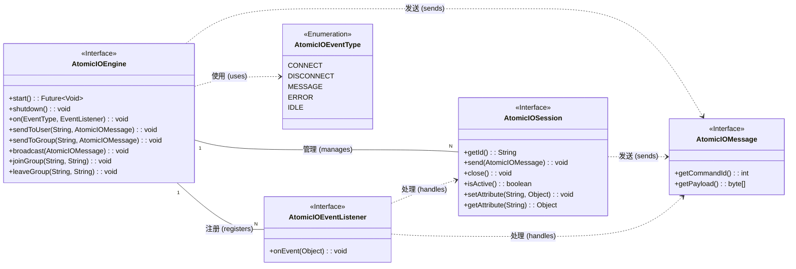
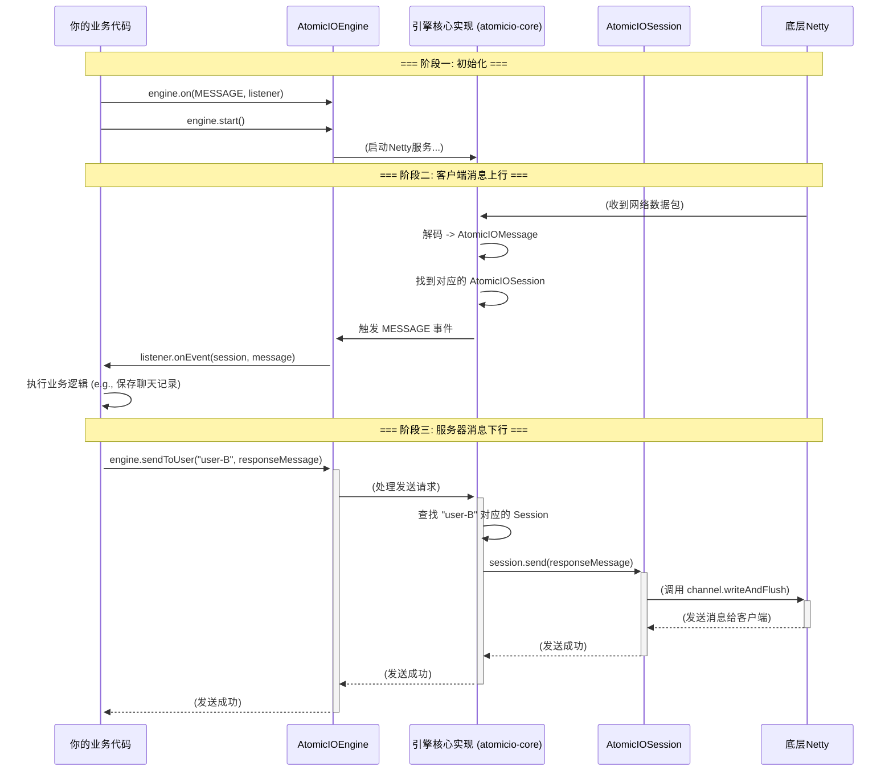
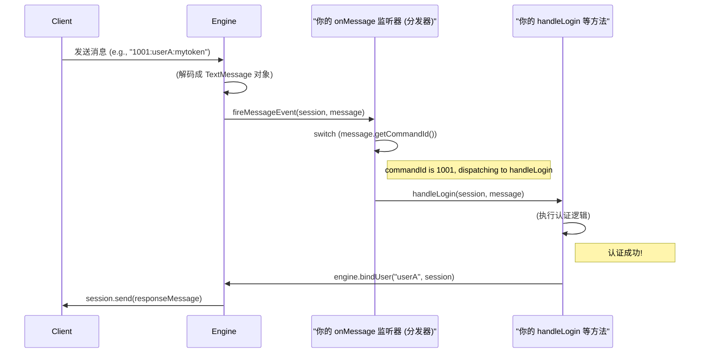
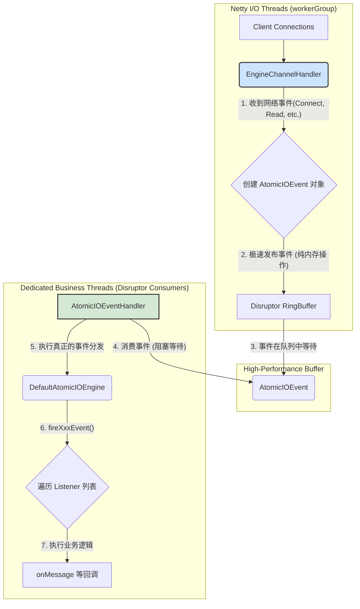
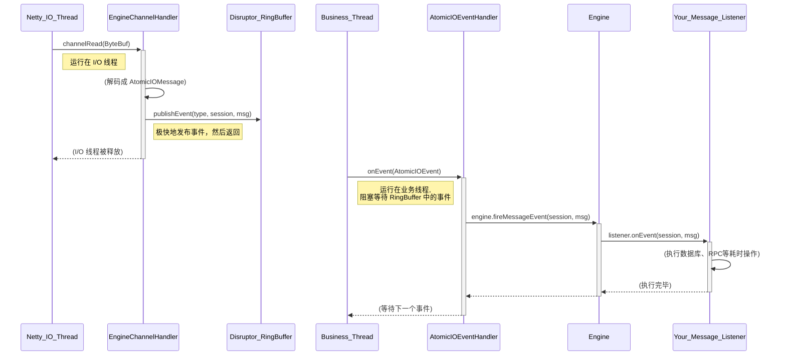

# Atomicio 阿多米西奥 🇨🇳
### 作者：Vevoly
Atomicio: A high-performance, reactive IO framework for IM, IoT, and Gaming, Streaming built on Netty.  
阿多米西奥：一个高性能的事件驱动IO框架，可用于即时通讯，物联网，游戏，流媒体等服务器的底层框架，基于Netty构建。

# Coming Soon !!!
# 框架正在不断迭代开发中，敬请期待 v1.0.0 版本...
Atomicio-Api 模块架构图

Atomicio-Api 模块数据流转图


## AtomicIOMessage
IM 场景示例：
```java
public class ImChatMessage implements AtomicIOMessage {
    public static final int COMMAND_ID = 2001;

    private String fromUserId;
    private String toUserId;
    private String content;

    // ... constructor, getters, setters ...

    @Override
    public int getCommandId() {
        return COMMAND_ID;
    }

    @Override
    public byte[] getPayload() {
        // 使用者选择用 JSON 序列化
        String json = new Gson().toJson(this);
        return json.getBytes(StandardCharsets.UTF_8);
    }
}
```
游戏场景示例：
```java
// 使用者自己定义的 Protobuf 生成的消息类
// message PlayerMove {
//   int32 x = 1;
//   int32 y = 2;
// }

// 假设 Protobuf 插件已经生成了 PlayerMove 类
public class GamePlayerMoveMessage implements AtomicIOMessage {
    public static final int COMMAND_ID = 2001;
    private PlayerMove protoMessage; // Protobuf 生成的对象

    public GamePlayerMoveMessage(PlayerMove protoMessage) {
        this.protoMessage = protoMessage;
    }

    @Override
    public int getCommandId() {
        return COMMAND_ID;
    }

    @Override
    public byte[] getPayload() {
        // 使用者选择用 Protobuf 序列化
        return protoMessage.toByteArray();
    }
}
```
## AtomicIOSession
1. IM / 在线客服场景:
* 核心需求: 将一个匿名的网络连接与一个具体的“用户”身份绑定。
* AtomicIOSession 的作用:
  * getId(): 用于日志追踪和问题排查，例如 "Session [xxx] disconnected due to heartbeat timeout."
  * send(message): 用于发送私聊或群聊消息。
  * setAttribute("userId", "user-123"): 这是整个场景的命脉。 当用户通过 LOGIN 指令认证成功后，业务逻辑会调用这个方法，将 userId 存入 Session。从此以后，这个 Session 就代表了 user-123。引擎在执行 sendToUser("user-123", ...) 时，就能通过这个属性找到对应的 Session。
2. 游戏服务器场景:
* 核心需求: 管理玩家状态，并将连接与玩家实体关联。
* AtomicIOSession 的作用:
  * isActive(): 在广播玩家位置同步帧之前，可以快速检查玩家是否还在线，避免无效操作。
  * close(): GM（游戏管理员）或反作弊系统可以用这个方法来“踢人下线”。
  * setAttribute(...) 的威力: 它可以被玩出花来。
    * session.setAttribute("playerId", 10086): 绑定玩家ID。
    * session.setAttribute("state", PlayerState.IN_LOBBY): 存储玩家当前的状态（在大厅、房间中、战斗中）。
    * session.setAttribute("roomId", "room-abc"): 存储玩家所在的房间ID，方便业务逻辑快速查找。
3. 物联网 (IoT) 场景:
* 核心需求: 身份认证（通常是设备ID或证书），并能对特定设备下发指令。
* AtomicIOSession 的作用:
  * send(message): 向设备下发远程控制指令（如“开灯”）或请求数据。
  * setAttribute("deviceId", "SN-A1B2C3D4"): 在设备通过认证后，将它的唯一设备ID绑定到 Session 上。
  * session.setAttribute("deviceType", "TemperatureSensor"): 还可以存储设备的类型、固件版本等元数据，方便进行分类管理和消息推送。

Disruptor 业务模型

