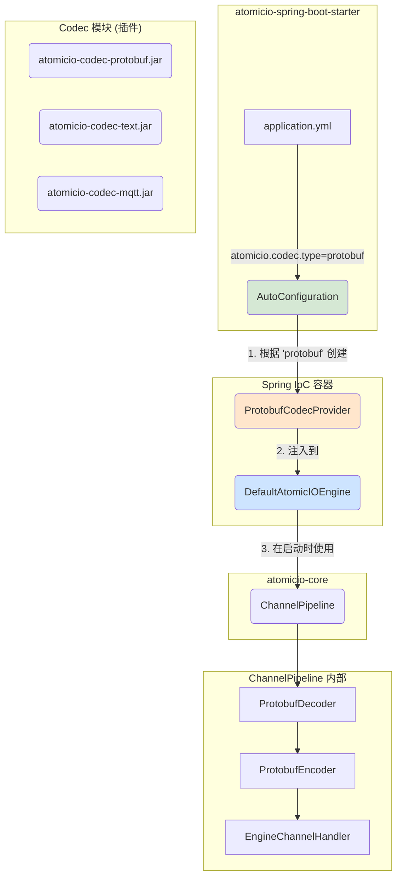
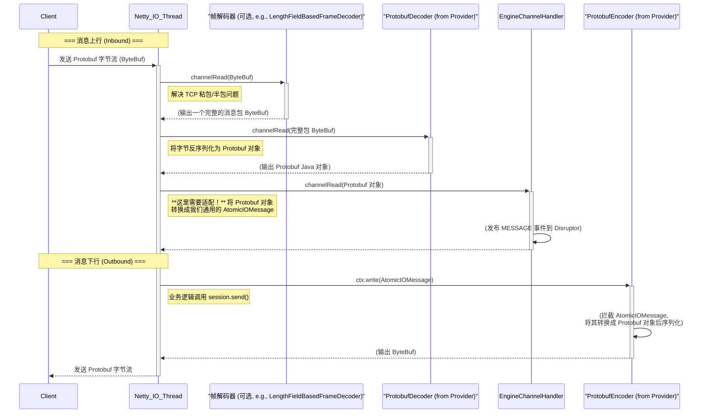
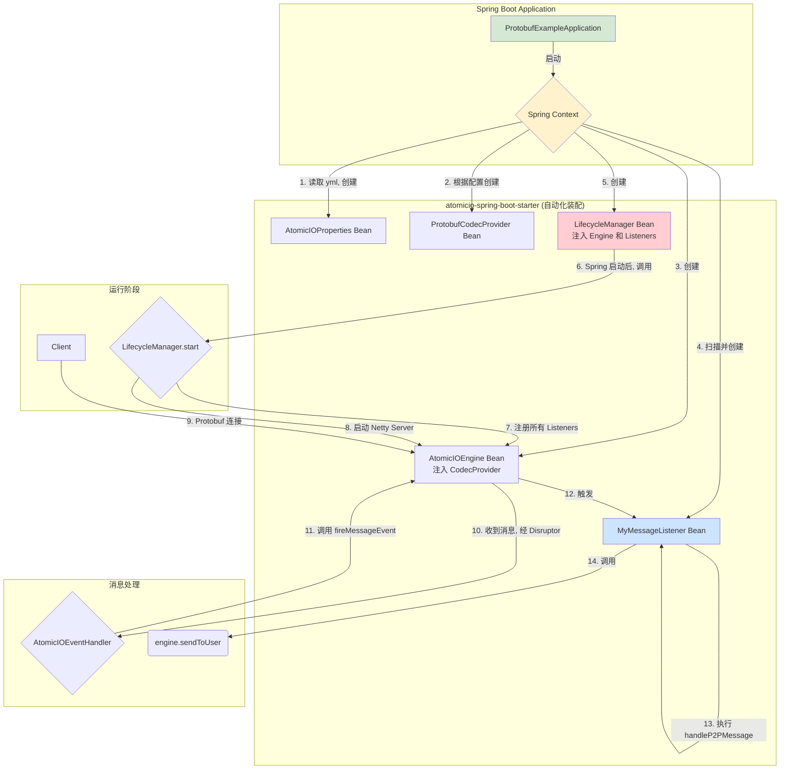
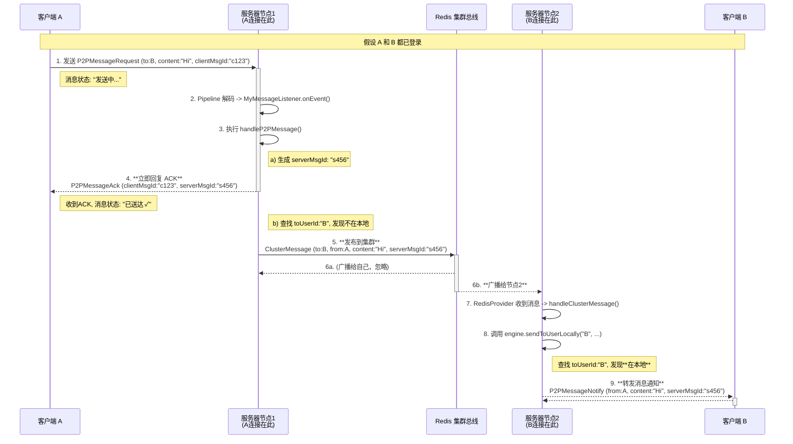

# 协议层升级




### 用户如何扩展 Protobuf ？
#### 1. 用户在自己的项目中，创建自己的 .proto 文件，例如 game.proto：
user-project/src/main/proto/game.proto
```protobuf
syntax = "proto3";

package com.mygame.proto;

option java_package = "com.mygame.proto";

message MyLoginRequest {
  string username = 1;
  string password = 2;
}

message MyPlayerMove {
  int32 x = 1;
  int32 y = 2;
}
```
#### 2. 用户的业务逻辑 (MyMessageListener)
```java
// 在用户的 MyMessageListener.java 中

@Override
public void onEvent(AtomicIOSession session, AtomicIOMessage message) {
    try {
        // 1. 将 AtomicIOMessage 的 payload 解码成 GenericMessage
        GenericMessage genericMsg = GenericMessage.parseFrom(message.getPayload());
        
        int commandId = genericMsg.getCommandId();
        google.protobuf.Any payload = genericMsg.getPayload();

        switch (commandId) {
            case CommandIds.LOGIN:
                // **关键：解包 Any**
                // is() 方法检查 Any 中包含的是否是 MyLoginRequest 类型
                if (payload.is(MyLoginRequest.class)) {
                    // unpack() 方法安全地将其解包
                    MyLoginRequest loginRequest = payload.unpack(MyLoginRequest.class);
                    handleLogin(session, loginRequest);
                }
                break;
            case CommandIds.PLAYER_MOVE:
                if (payload.is(MyPlayerMove.class)) {
                    MyPlayerMove moveRequest = payload.unpack(MyPlayerMove.class);
                    handlePlayerMove(session, moveRequest);
                }
                break;
        }
    } catch (InvalidProtocolBufferException e) {
        log.error("Failed to parse protobuf message", e);
        session.close();
    }
}

// 业务处理方法现在接收的是具体的、强类型的 Protobuf 对象
private void handleLogin(AtomicIOSession session, MyLoginRequest request) {
    // ...
}
```
#### 3. 客户端发送消息
```java
// 在客户端代码中
MyLoginRequest loginRequest = MyLoginRequest.newBuilder()
        .setUsername("test")
        .setPassword("123456")
        .build();

GenericMessage genericMsg = GenericMessage.newBuilder()
        .setCommandId(CommandIds.LOGIN)
        // **关键：打包 Any**
        .setPayload(com.google.protobuf.Any.pack(loginRequest))
        .build();

// 将 genericMsg 序列化后发送
byte[] dataToSend = genericMsg.toByteArray();
```

### Protobuf-example 架构图

### P2P 消息数据流转时序图

