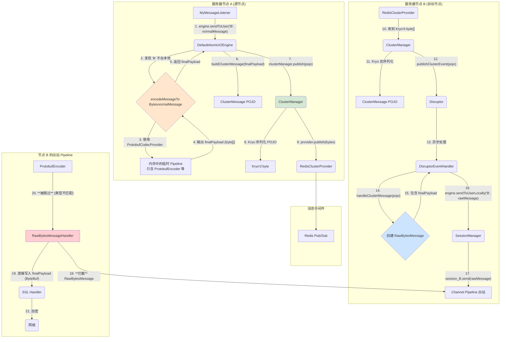

### 协议无关的集群消息转发机制

1. 打包 (服务器 A):
   * Engine 收到发送请求后，调用 encodeMessageToBytes，利用当前节点的 CodecProvider (比如 ProtobufCodecProvider) 在一个内存 Pipeline 中，将 AtomicIOMessage “预编码”成最终要发送到网络上的二进制形态 finalPayload。
   * 然后，它将这个 finalPayload 连同路由元数据，一起打包成一个 ClusterMessage POJO。
   * ClusterManager 使用 Kryo (与上层协议无关的二进制序列化) 将这个 POJO 打包成最终的 byte[]，发往 Redis。
2. 中转 (Redis):
   * Redis 只是一个“字节搬运工”，它完全不知道自己传输的是什么内容。
3. 拆包与投递 (服务器 B):
   * ClusterManager 收到字节，用 Kryo 反序列化出 ClusterMessage POJO。
   * DisruptorEventHandler 从 POJO 中取出 finalPayload，并将其包装成一个特殊的 RawBytesMessage。这个 RawBytesMessage 就像一个贴着“VIP-免检”标签的包裹。
   * SessionManager 调用 session.send() 发送这个“VIP 包裹”。
4. 绿色通道 (节点 B 的 Pipeline):
   * 当“VIP 包裹” (RawBytesMessage) 在 Pipeline 中向上流动时，我们新加的 RawBytesMessageHandler 会识别并拦截它。
   * 它直接拆开包裹，将里面的 finalPayload (已经是最终的二进制形态) 写入 ByteBuf，然后传递给下一站（比如 SslHandler）。
5. 后续的常规编码器（ProtobufEncoder）因为不认识 RawBytesMessage (或者 RawBytesMessageHandler 已经把消息变成了 ByteBuf) 而被优雅地跳过。
6. 消息最终被成功发送。