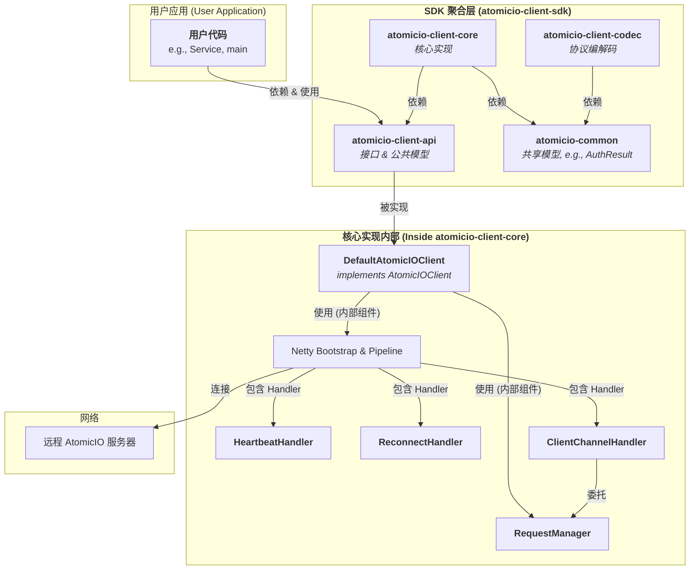

## 客户端升级方案 （第一次升级）v0.6.7

```mermaid
graph TD
    subgraph "用户应用空间 (User Application)"
        A[<b>用户代码</b><br>e.g., Spring Service, UI Controller]
        B[<b>用户监听器</b><br>e.g., onPushMessage, onDisconnected]
        C[<b>application.yml</b><br>配置 host, port, deviceId, etc.]
    end

    subgraph "<b>AtomicIO 客户端 SDK (atomicio-client-starter)</b>"
        subgraph "API 外观层 (Facade)"
            D{<b>AtomicIOClient</b><br> Bean}
        end

        subgraph "核心管理器 (Core Managers)"
            E[<b>RequestManager</b><br>SequenceId & Future 匹配]
            F[<b>HeartbeatManager</b><br>定时心跳 & 死链检测]
            G[<b>ReconnectionManager</b><br> 自动重连策略]
        end

        subgraph "网络处理层 (Netty Pipeline)"
            H[Channel]
            I{<b>协议编解码器</b><br>Protobuf/Text Codec}
            J[<b>ClientMessageHandler</b><br>智能路由]
        end

        subgraph "配置与自动装配"
            K[<b>AtomicIOClientProperties</b><br>@ConfigurationProperties]
            L[<b>AtomicIOClientAutoConfiguration</b><br>创建所有 Beans]
        end
    end

    subgraph "网络"
        M[远程 AtomicIO 服务器]
    end

    %% 关系连线
    A -- "调用高级 API (login, sendMessage)" --> D
    D -- "注册监听器" --> B
    C -- "加载配置" --> K
    K -- "提供配置" --> L
    
    L -- "创建" --> D
    L -- "创建" --> E & F & G
    L -- "配置 Pipeline" --> J & I

    D -- "委托" --> E
    D -- "控制" --> F & G
    
    E -- "被调用" --> J
    
    D -- "发起网络请求" --> H
    H <--> I <--> J
    H <--> M

    M -- "推送消息" --> H
    J -- "触发回调" --> B
```



### AtomicIO 三种 ID 的区别：
1. sequenceId (由客户端生成)
* 职责: 请求-响应匹配。它的唯一作用就是将一个网络响应与它所对应的那个网络请求进行唯一的关联。
* 生命周期: 从客户端发起一个需要响应的请求开始，到客户端收到该请求的响应结束。它是一个端到端 (Client <-> Server)、短生命周期的ID。
* 谁关心它: 客户端的 RequestManager 和服务器端的 CommandDispatcher（在创建响应时需要原样返回）。
2. clientMessageId (由客户端生成)
* 职责: 客户端本地的消息去重和状态跟踪。例如，确保用户在网络不好时连续点击发送，只有一条消息被真正处理。或者用于在本地数据库中唯一标识一条消息，以更新其发送状态（发送中 -> 已送达 -> 已读）。
* 生命周期: 可能非常长，从消息在客户端创建开始，直到被删除。
* 谁关心它: 只有客户端的业务逻辑和本地存储关心。服务器通常不关心这个ID。
3. 服务器ID (由服务器生成)
* 职责: 服务器端的消息持久化和全局唯一标识。当服务器收到一条消息后，如果要将其存入数据库（例如聊天记录），就必须为它生成一个在整个分布式系统中都唯一的ID。这个ID将作为数据库的主键。
* 生命周期: 永久（只要数据在数据库中）。
* 谁关心它: 只有服务器端的业务逻辑和持久化层关心。客户端完全不应该知道或依赖这个ID的存在。