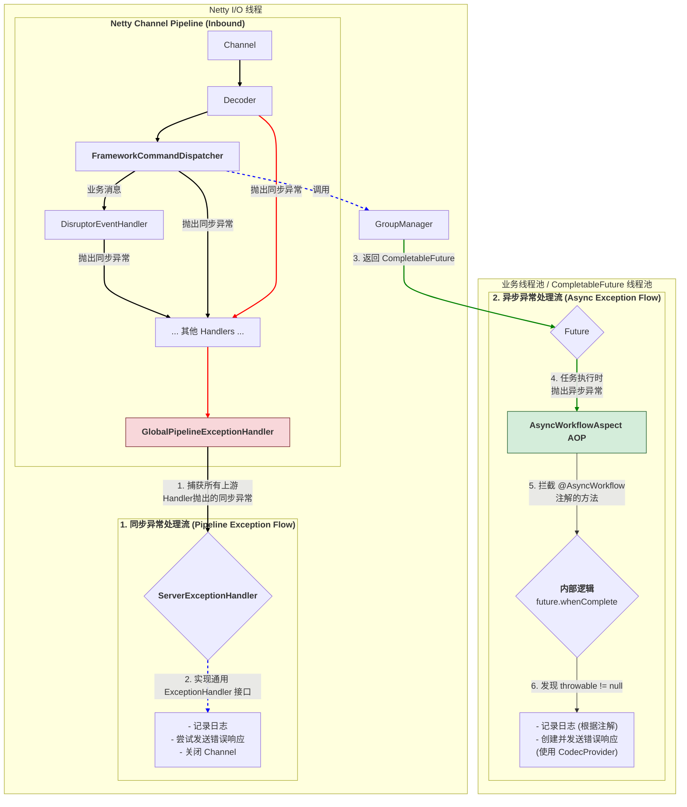

## 异常处理机制设计

1. 同步异常处理流 (红色路径)
   * 触发点:   
     在 Netty I/O 线程中，任何一个 Handler（如 Decoder, AtomicIOCommandDispatcher）的代码在执行时直接抛出了一个未被捕获的异常。
   * 传播方式:   
     异常会沿着 Netty Pipeline 向后传播，跳过所有正常的 Handler。
   * 捕获者: 
     位于 Pipeline 末端的 GlobalPipelineExceptionHandler。它就像是 Pipeline 的“安全网”，负责捕获所有掉下来的同步异常。
   * 处理者:   
     GlobalPipelineExceptionHandler 自身不包含复杂的逻辑，它只是一个适配器，它将捕获到的 cause 和 ChannelHandlerContext，委托给我们通用的 ServerExceptionHandler 实例。
   * 最终动作: 
     ServerExceptionHandler 执行具体的处理逻辑：记录日志，并利用 ChannelHandlerContext 来尝试关闭连接或发送最后的消息。
2. 异步异常处理流 (绿色路径)
   * 触发点:   
     AtomicIOCommandDispatcher 调用了一个返回 CompletableFuture 的业务方法（例如 groupManager.joinGroup()）。这个 Future 在一个不同的线程（业务线程池）中执行，并在执行过程中抛出了异常。
   * 传播方式:   
     这个异常不会进入 Netty Pipeline。它被 CompletableFuture 内部捕获，并将 Future 的状态标记为“异常完成”。
   * 捕获者:   
     AsyncWorkflowAspect (AOP 切面)。它通过 @Around 通知，包裹了原始方法的调用。它拿到了原始方法返回的那个 Future。
   * 处理者:  
     Aspect 为这个 Future 附加了 .whenComplete (或 .handle) 回调。当 Future 异常完成时，这个回调被触发，throwable 参数将不再是 null。
   * 最终动作: 
     Aspect 内部的逻辑根据 @AsyncWorkflow 注解提供的配置，记录日志，并利用它持有的 Session 和 CodecProvider 的引用，来创建并发送一个标准的错误响应。
