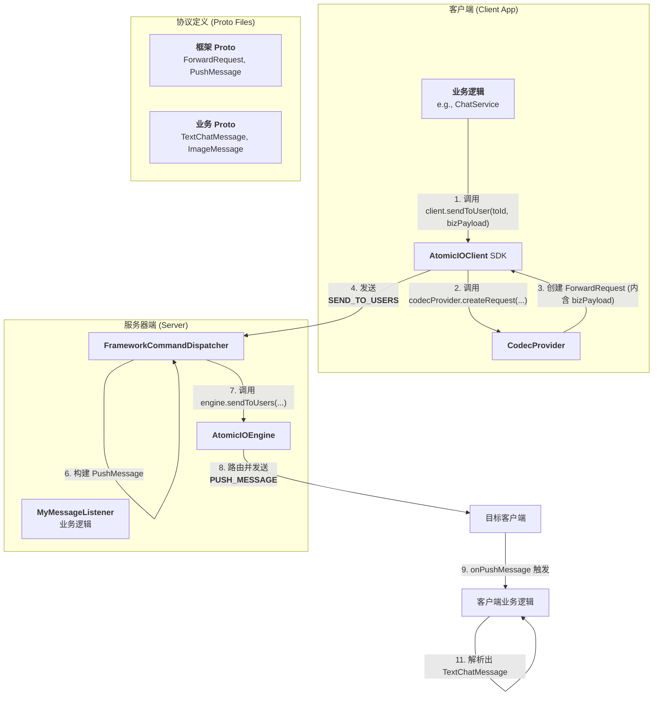
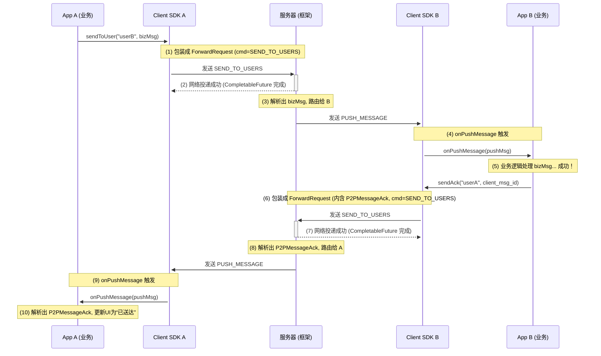

## 数据发送（路由）方案

### 数据路由设计

### 消息群发设计
#### 流程:
1. engine.sendToUsers(["user1", "user2", ...], msg) -> 节点X 发现这些用户分布在 A, B, C 三个节点。
2. 它将这些用户按所在节点进行分组：
   * Node A: ["user1"]
   * Node B: ["user2", "user3"]
   * Node C: ["user4"]
3. 然后，它为每个目标节点只发送一条批量集群消息：
   * -> 节点A: BatchClusterMessage(to=["user1"], payload=msg)
   * -> 节点B: BatchClusterMessage(to=["user2", "user3"], payload=msg)
   * -> 节点C: BatchClusterMessage(to=["user4"], payload=msg)
4. 目标节点（如节点B）收到 BatchClusterMessage 后，在本地进行循环，将消息分发给 user2 和 user3。
#### 资源消耗:
* Redis Pub/Sub: 只发布了 3 条消息（因为只有3个目标节点）。
* Kryo 序列化/反序列化: 只执行了 3 次。
* 网络传输: 只产生了 3 次网络数据包。
#### 优点:
1. 降低中间件压力: 当 userIds 列表非常大时（例如，给 10000 个用户发送通知，他们分布在 10 个节点上），循环发送会瞬间向 Redis 写入 10000 条消息，可能导致 Redis 阻塞。而批量方案只会写入 10 条消息。这是最核心的优势。
2. 减少网络 I/O: 减少了网络数据包的数量，降低了网络拥塞的可能性。
3. 降低序列化开销: message 本身（可能是个大对象）只需要被序列化 3 次，而不是 4 次。
4. 原子性更强: 目标节点一次性收到所有需要它处理的用户列表，便于进行事务性操作或日志记录。

### 集群精准投递
1. 全局广播的灾难:
* 节点A 向 Redis 的全局频道发布一条消息：“请把这个包裹转交给 userX”。
* 集群中所有的节点（A, B, C, D, ...）都会收到这条广播消息。
* 每个节点都必须在本地检查：“userX- 在我这里吗？”
* 最终，只有节点B 发现 userX 在本地，并进行投递。其他所有节点都做了无用功，白白浪费了 CPU 和网络资源。
2. 精准投递：
* userId -> nodeId 的映射，节点 A 可以直接查询得知 userX 在节点 B，然后只向节点 B 的专属频道发送一条消息，干净利落。
3. 维护 userId -> nodeId 映射关系：
* Hash 数据结构
  * key: atomicio:stats:user_nodes
  * field: userId
  * value: nodeId
* 职责划分
  * AtomicIOSessionStateProvider (接口): 负责定义**“注册”、“注销”和“查询”**这个全局映射的契约。
  * RedisSessionStateProvider (实现): 负责使用 HSET, HDEL, HGET, HMGET 等 Redis 命令来具体实现这些契约。