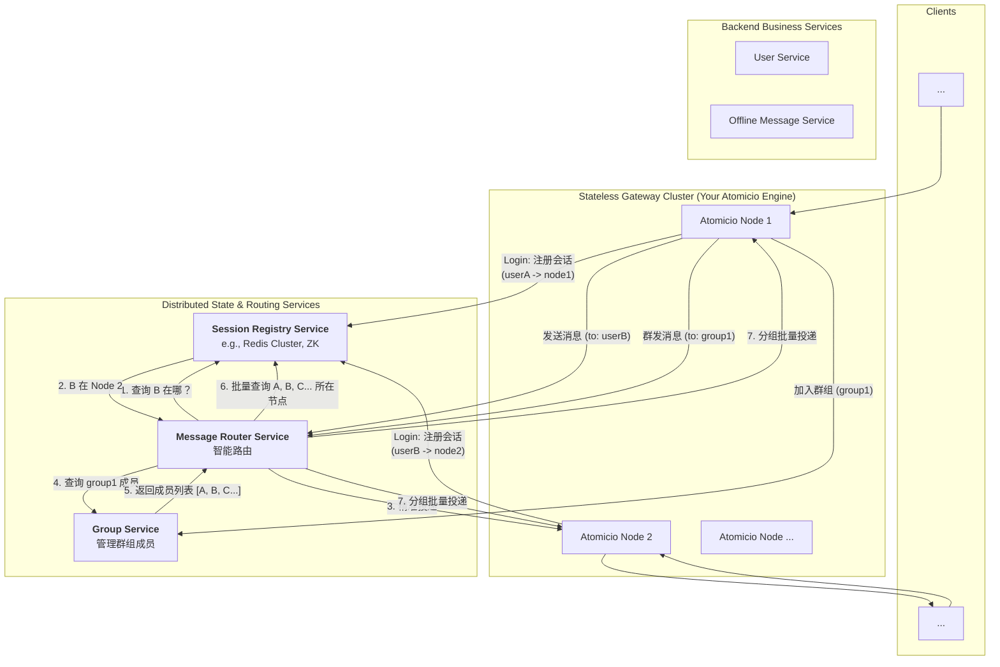

## 千万-亿级别的无状态架构

继续完善当前的“简单集群”模型:
把 bindUser 的多端登录配置化做好。
把心跳、重连等机制彻底打磨好。
让 CodecProvider 体系成熟起来。
目标: 发布一个强大的 v1.0 版本，它基于 Redis Pub/Sub，是一个开箱即用的、高性能的“分布式 IO 引擎”。
在文档中明确架构的边界:
在我们的架构文档中，明确指出：当前的集群模型适用于 X 级别的并发。对于千万级的超大规模部署，Atomicio 需要与外部的状态/路由服务集成，并提供相应的扩展接口。
为“无状态”演进预留接口:
我们可以提前在 api 模块中设计一些“未来”的接口，比如 SessionRegistryProvider, GroupServiceProvider。
DefaultAtomicIOEngine 的默认实现，可以使用一个**“In-Memory” (基于 Map) 的实现**。
这样，未来高级用户就可以通过 Spring 替换掉这些默认实现，插入一个与外部 Redis Cluster 或 Zookeeper 对接的实现，而无需修改 Atomicio 的核心代码。