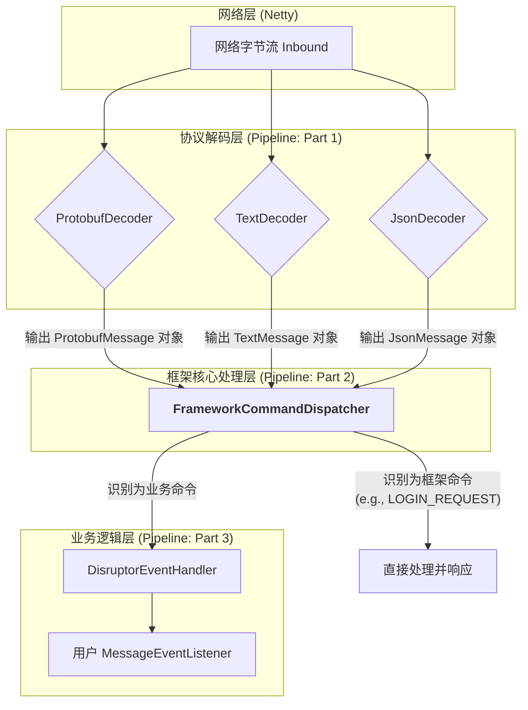

## 混合驱动模型架构设计 0.6.5
### 核心演进对比

### 混合驱动模式架构图

* FrameworkCommandDispatcher 成为网络层的第一道关卡。它像一个智能路由器，根据 CommandId 对消息进行分流。
* 框架命令流: Dispatcher 识别出登录、登出等框架命令后，会直接调用 AtomicIOEngine 的内部方法，这些方法再委托给相应的 Manager (StateManager, SessionManager等) 来执行核心逻辑。
* 业务命令流: Dispatcher 识别出是业务命令后，会像以前一样，将消息传递给 DisruptorEventHandler，最终触发用户注册的 MessageEventListener。
* 认证回调: Engine 提供了一个方法（如 setAuthenticator）让用户注入一个 Authenticator 实现。当 Dispatcher 收到登录请求时，会通过 Engine 回调这个用户的认证逻辑，从而实现了框架逻辑和业务认证逻辑的解耦。

### 数据流转时序图

1. 客户端发送登录请求。
2. FrameworkCommandDispatcher 截获该请求。
3. Dispatcher 不直接处理业务认证，而是通过 Engine 调用已注册的用户Authenticator。
4. 用户Authenticator 返回认证结果。
5. 如果成功，Dispatcher 自动调用 Engine 的内部绑定方法，触发 StateManager 和 SessionManager 的一系列核心操作。
6. 所有框架层面的状态更新完成后，Dispatcher 自动给客户端回复一个标准的 LOGIN_RESPONSE。
7. 在这个过程中，用户的 MessageEventListener 完全没有被调用，登录流程对业务代码完全透明。

### 入站数据流转图
