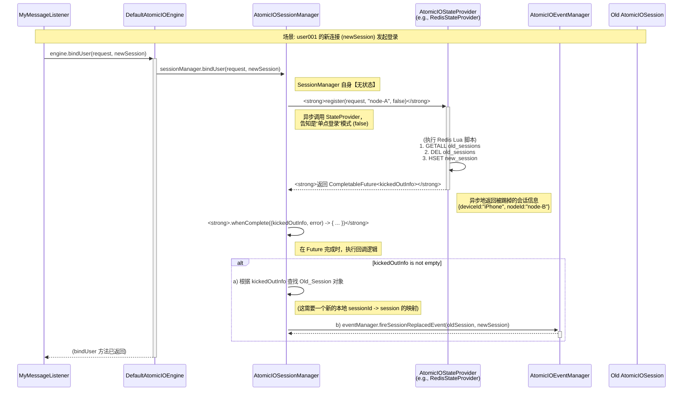
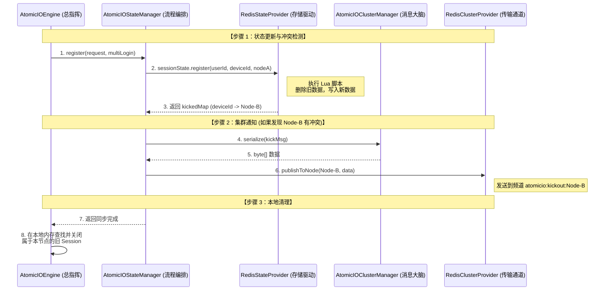
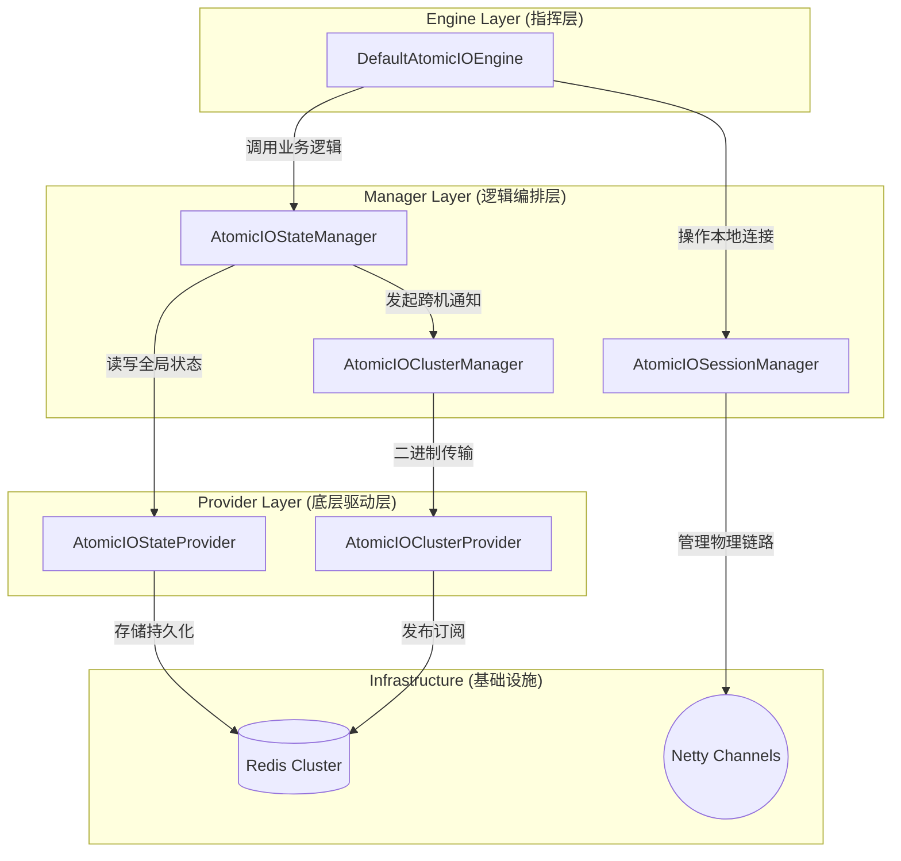
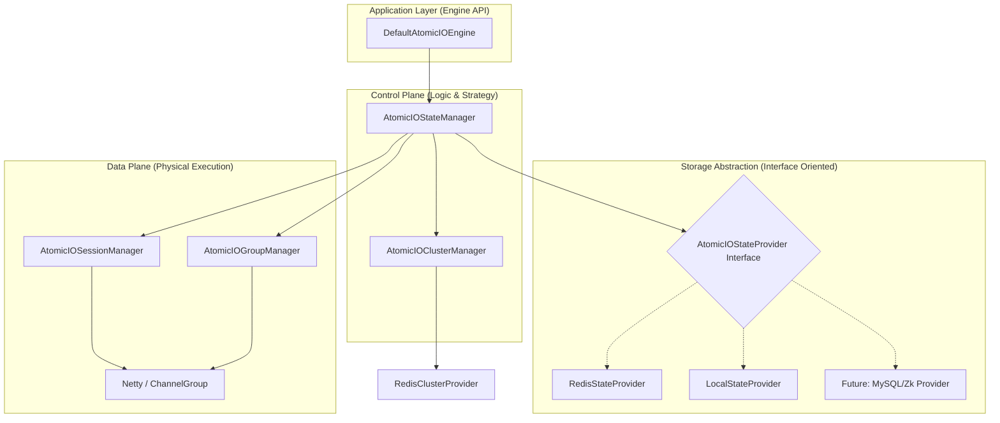
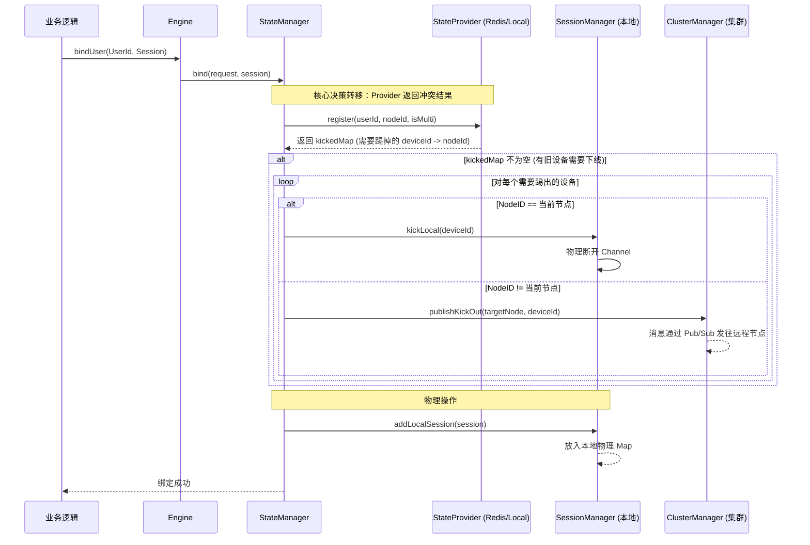

### 状态存储设计 0.6.4

### Redis 作为状态存储的瓶颈在哪里？
#### Redis 作为状态存储，是极其优秀的选择，足以支撑千万级甚至亿级的用户。但它并非没有瓶颈。
#### 瓶颈主要来自以下几个方面:
1. 单机 Redis 的物理极限 (Scale-Up Limit):
* 内存: Session Registry 需要存储所有在线用户的 userId -> GatewayNodeId 映射。如果有 1000 万在线用户，即使每个条目只占 100 字节，也需要 1000 * 100 * 100万 = 1GB 的内存。再加上群组信息、其他业务缓存，内存会成为第一个瓶颈。
* CPU: Redis 是单线程处理命令的。虽然极快，但当 QPS (每秒查询次数) 达到几十万甚至上百万时（比如大量用户同时上线/下线），单个 CPU 核心会成为瓶颈。
* 网络 I/O: 服务器网卡的吞吐量是有限的。
2. Redis 集群的复杂性 (Scale-Out Complexity):  
   为了突破单机瓶颈，我们必须使用 Redis Cluster。
* 数据分片 (Sharding): Redis Cluster 通过哈希槽 (hash slots) 将数据分散到多个节点上。userId 和 groupId 必须被精心设计，以确保相关数据尽可能地落在同一个分片上，避免昂贵的跨节点查询。
* 热点问题 (Hotspot): 如果一个超级大群（比如一个有 50 万成员的“世界杯直播群”）的所有信息都落在同一个 Redis 节点上，这个节点就会成为整个集群的性能瓶颈。需要通过“读写分离”、“多级缓存”等策略来解决。
3. “大 Key”问题:
* 场景: 还是那个 50 万成员的“世界杯直播群”。如果用一个 Redis Set (group:world_cup) 来存储所有 50 万个 userId，这个 Set 就成了一个“大 Key”。
* 危害: 对这个“大 Key”进行一次 SMEMBERS (获取所有成员) 操作，可能会阻塞 Redis 数百毫秒甚至数秒，导致其他所有请求被延迟，引发“雪崩”。
* 解决方案:
  * 避免全量查询: Group Service 绝对不能一次性获取 50 万成员。它应该分页获取 (SSCAN)。
  * 数据拆分: 将一个大 Set 拆分成多个小 Set，比如 group:world_cup:1, group:world_cup:2...
4. 网络延迟:
* 每次对 Redis 的读写，都是一次网络往返。虽然在内网中这个延迟很低（通常 < 1ms），但在需要连续多次查询才能完成一次操作的场景下，延迟会被放大。 
#### 结论: Redis 自身性能极高，但要用好它来支撑超大规模状态存储，需要精心的数据结构设计、集群规划、以及对“大 Key”和“热点”问题的高度警惕。

### 大厂的“服务化”架构优缺点? 
#### “群组路由服务”和“Session 注册中心”，本质上是将“状态存储”和“路由逻辑”从框架的网关层中剥离出来，成为独立的微服务。
1. 优点 (压倒性的):
* 终极的关注点分离:
  * Atomicio (网关层): 只关心网络 IO。它变得极其轻量、稳定和无状态。
  * Session Registry: 只关心“谁在哪”。
  * Group Service: 只关心“群里有谁”。
  * Router Service: 只关心“消息该往哪走”。
  * 每个服务都可以由独立的团队开发、部署、扩缩容和维护。
* 极致的弹性伸缩:
  * 如果在线用户暴增，只需要扩容 Session Registry 服务。
  * 如果群聊消息暴增，只需要扩容 Group Service 和 Router Service。
  * 如果只是新连接请求暴增，只需要扩容 Atomicio 网关节点。
  * 每个组件都可以根据自身的瓶颈进行独立的、精细化的扩缩容。
* 技术异构性:
  * Atomicio 用 Java 和 Netty 实现，追求极致 IO 性能。
  * Router Service 可以用 Go 语言实现，追求高并发和快速的逻辑处理。
  * Group Service 可以用 Python 实现，方便进行数据分析和管理。
  * 每个服务都可以选择最适合其应用场景的技术栈。
2. 缺点:
* 架构极其复杂:
  * 引入了大量的微服务和它们之间的 RPC 调用。
  * 需要一个强大的服务治理框架（如 Istio, Consul）、RPC 框架（gRPC, Dubbo）、分布式追踪系统（Jaeger, SkyWalking）来管理这一切。
* 运维成本极高:
  * 部署、监控、排错的复杂度呈指数级上升。
* 性能开销:
  * 服务间的每一次 RPC 调用，都带来了额外的网络延迟和序列化开销。

### 用户外接自己的服务
#### 用户外接自己的 session 注册中心 和 群组路由服务
我们通过可插拔接口的设计，为这种终极扩展提供了完美的“电源插座”。
StatusProvider 接口，就是“Session 注册中心”和“群组服务”的一个“只读”视图。 
#### 可外接的架构:
1. 定义“服务提供者接口 (SPI)”:
在 api 模块中，定义 SessionRegistryProvider 和 GroupStateProvider 接口。
2. DefaultAtomicIOEngine:
* 它的构造函数注入这些 Provider 的实现。
* bindUser 方法不再操作本地 Map，而是调用 sessionRegistryProvider.register(...)。
* joinGroup 方法调用 groupStateProvider.join(...)。
3. starter 的角色:
* starter 会提供默认的、基于 Redis 的 RedisSessionRegistryProvider 和 RedisGroupStateProvider 实现。
* 这些默认实现都使用了 @ConditionalOnMissingBean。
#### 用户的终极玩法:
一个大厂用户，他们公司内部已经有一套基于 Zookeeper 的、极其强大的“会话中心”。 他们只需要：
* 创建一个 MyZkSessionRegistryProvider，实现 SessionRegistryProvider 接口，内部调用他们公司的 ZK 客户端。 
* 将这个实现注册为一个 @Bean。
* Atomicio 的 starter 会自动发现用户的 Bean，不再创建默认的 Redis 实现，并将用户的 Zk 实现无缝地注入到 Atomicio 引擎中。
### 结论:
#### Atomicio 不应该自己成为一个复杂的微服务集群，但它必须能够作为一个核心组件，被无缝地集成到用户自己的微服务集群中。
#### 改造状态存储三原则
1. 绝对无状态 (Stateless Managers): SessionManager 和 GroupManager 自身不再存储任何状态（没有 Map）。它们变成了纯粹的“指令发出者”。
2. 状态外置 (Externalized State): 所有的状态数据，都由唯一的“事实来源”——StateProvider (无论是 Local 还是 Redis 实现) 来管理。
3. 万物皆异步 (Everything is Async): 任何与 StateProvider 交互的操作，都必须是异步的，并返回 CompletableFuture。
### 流程图

### 流程图解读:
1. 起点: 用户的 Listener 调用 engine.bindUser()。
2. 委托: Engine 将这个请求委托给 SessionManager。
3. 核心操作 (异步):
* SessionManager 不再自己操作 Map。
* 它调用 StateProvider.register()，并将所有必要信息（request, 当前节点ID, 以及 isMultiLogin=false 这个关键策略）都传递过去。
* 这个调用立即返回一个 CompletableFuture，SessionManager 不会在这里阻塞。
4. 状态原子更新 (在 StateProvider 内部):
* RedisStateProvider 执行一个 Lua 脚本。这个脚本在 Redis 服务器上原子性地完成三件事：获取旧的会话信息，删除旧的，写入新的。
* LocalStateProvider 也会在一个 synchronized 块中，原子性地完成同样的操作。
* StateProvider 将被踢掉的会话信息，作为 Future 的结果，异步地返回。
5. 异步回调与事件触发:
* SessionManager 使用 .whenComplete() 为 Future 注册了一个回调。
* 当 Redis (或 LocalStateProvider) 的操作完成后，这个回调被触发。
* 在回调中，SessionManager 检查 kickedOutInfo 是否为空。
* 如果不为空，它就找到了被踢掉的 oldSession 的信息。此时，它需要一个本地的、临时的 sessionId -> session 映射来找到 oldSession 的 Java 对象。
* 然后，它调用 EventManager.fireSessionReplacedEvent() 来触发业务事件。

### 二次重构状态存储

#### 内存与存储解藕
1. AtomicIOStateManager (全局状态指挥官) —— 新增
*  它是唯一知道“数据该存哪”和“该不该发集群通知”的组件。
   * 职责：编排存储和通信。
   * 动作：调用 StateProvider（写 Redis） -> 拿到结果 -> 如果有跨机冲突，调用 ClusterManager（发通知）。
   * 地位：它是 Engine 的直接下属。
2. AtomicIOSessionManager (本地内存管家) —— 重构
*  它应该退化为纯内存管理，不再关心 Redis。
   * 职责：管理当前节点上的 Map<UserId, NettySession>。
   * 动作：添加 Session、根据 ID 查找本地连接、执行本地 channel.close()。
   * 地位：它是 Engine 用来操作物理连接的工具。
3. AtomicIOStateProvider (原子驱动) —— 重构
*  它彻底变成一个“哑巴驱动”。
   * 职责：只负责 Redis 脚本执行。
   * 动作：执行 Lua 脚本 -> 返回 Map。它不知道什么是“集群消息”，也不知道什么是“Kryo”。
   * 地位：它是 StateManager 的底层插件。
#### 优点
* 内存与存储解耦：如果关闭集群模式，StateManager 只需要切换到 LocalStateProvider，而 SessionManager（内存管理）逻辑一行都不用改。
* 并发安全：由于只有 StateManager 一个入口负责协调 Redis 和消息，更容易保证“先改账本、后发通知”的原子性。
* 易于测试：单独测试内存管理逻辑，而不需要启动 Redis。
* 总结一句话： 将 “逻辑（怎么踢）” 留在 Manager，将 “数据（存哪）” 留在 Provider，将 “物理连接（Channel）” 留在 SessionManager。

#### 重构后的架构图

