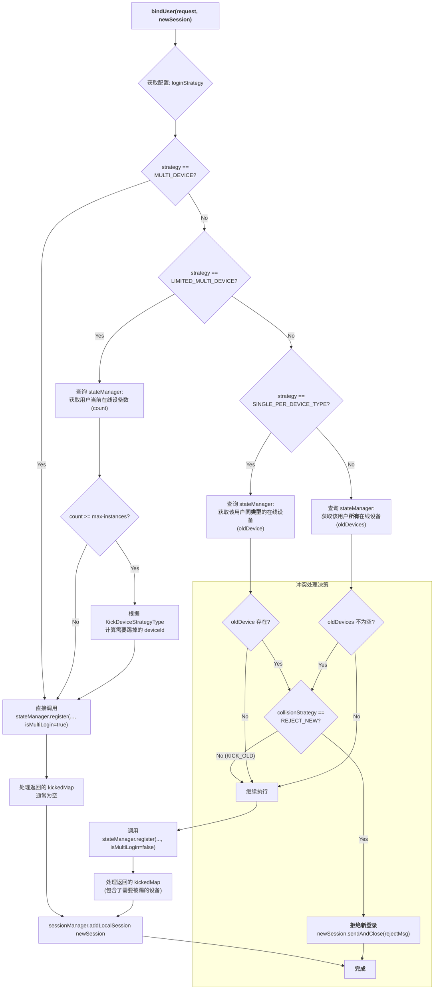
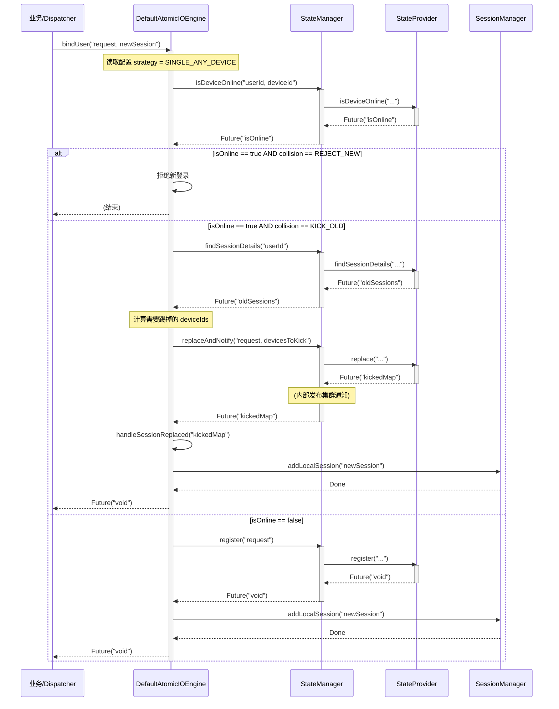

## 登录策略方案

### 四种登录策略
1. 全局单点登录 (Single Device Login Only)
* 定义: 一个 User 在任何时间、任何地点，只能有一个活跃的 Device Instance。
* 行为: 当 userA 在 iPhone 上登录后，如果他再尝试用同一个账号 userA 在 MacBook 上登录，iPhone 会被立即踢下线。
* 例子: 大部分网络游戏（如《英雄联盟》、《魔兽世界》）、银行App。
2. 按设备类型单点登录 (Single Device Per Type)
* 定义: 一个 User 可以同时在不同类型的设备上登录，但对于同一种类型的设备，只能有一个活跃实例。
* 行为:
  * userA 在 iPhone (iOS) 上登录。OK。
  * userA 再在 MacBook (PC) 上登录。OK，iPhone 不会被踢下线。两者同时在线。
  * userA 再在另一台电脑的微信 (PC) 上登录。冲突发生！ MacBook 上的微信会被踢下线。
* 例子: 微信、QQ、Telegram 等绝大多数现代 IM 应用。它们允许你手机和电脑同时在线，但不允许两个手机或两台电脑同时登录同一个账号。
3. 全局多点登录 (Full Multi-Device Login)
* 定义: 一个 User 可以同时在任意数量、任意类型的设备上登录。
* 行为: 没有任何限制。userA 可以在 2 个 iPhone 和 3 个 PC 上同时登录，它们都互相不影响。
* 例子: Discord, Slack (在一定程度上)。
4. 有限多点登录 (Limited Multi-Device Login)
* 定义: 一个 User 最多只能同时在 N 个设备上登录。
* 行为: 当 userA 尝试在第 N+1 个设备上登录时，会发生冲突。此时，根据具体策略，可能会：
  * 踢掉最早登录的设备 (LRU - Least Recently Used)。
  * 拒绝新设备的登录。
* 例子: 一些流媒体服务（如 Netflix），限制一个账号最多在 4 个设备上同时观看。
### 登录策略流程图

### 流程解读
1. 入口: bindUser 方法启动，首先读取配置的 loginStrategy。
2. 简单路径 (多设备): 如果是 MULTI_DEVICE，直接调用 register(isMultiLogin=true)，流程最简单。
3. 有限多设备路径: 如果是 LIMITED_MULTI_DEVICE，先查询当前设备数，如果超限，则计算出需要被踢掉的设备，然后继续走 register 流程（register 内部会根据传入的参数来执行替换）。
4. 单设备路径 (核心):
* 根据是“全局单点”还是“按类型单点”，查询逻辑有所不同（findSessions vs findSessionByDeviceType）。
* 冲突检测: 检查是否查询到了已存在的旧设备。
* 冲突决策: 如果存在冲突，则读取 collisionStrategy 配置。
  * 如果是 REJECT_NEW，则直接向 newSession 发送拒绝消息并关闭，流程结束。
  * 如果是 KICK_OLD（默认），则继续向下执行。
5. 注册与踢人: 调用 stateManager.register(isMultiLogin=false)。这个方法现在只负责“替换”操作，它会原子性地用新 Session 替换旧 Session，并返回被替换掉的 kickedMap。
6. 本地处理: Engine 拿到 kickedMap 后，处理本地的踢人逻辑和 SessionReplaced 事件。
7. 入库: 所有冲突解决后，将 newSession 加入 SessionManager。
8. 完成: 整个 bindUser 流程结束。

### 数据流转图

### 流转图解读
1. 检查: Engine 首先通过 SM.isDeviceOnline 进行预检。
2. 决策: Engine 根据预检结果和配置，决定是拒绝还是继续。
3. 执行:
* 如果需要踢人，Engine 先查询 (findSessionDetails)，再计算出要踢的列表，最后调用 SM.replaceAndNotify 这个原子性的写操作。
* 如果不需要踢人，直接调用 SM.register。
4. 收尾: 无论哪种路径，最后都将 newSession 加入本地的 SessionManager。