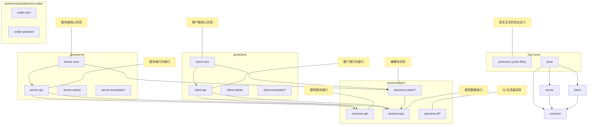

###  0.6.2 通信协议 C/S 拆分


```
common 模块 (基础):
common-api: 定义通用服务接口 (IdGenerator) 和配置模型 (AtomicIOProperties)。
protocol-api: 定义通用数据接口 (AtomicIOMessage)。
atomicio-id/*: 提供 IdGenerator 的具体实现。
atomicio-codec/*: 提供可被 C/S 两端复用的、中立的 Handler。但是，CodecProvider 不在这里！
server 模块 (服务器端):
server-api:
定义 AtomicIOEngine 接口。
定义服务器端专属的 ServerCodecProvider 接口。
server-core:
实现 DefaultAtomicIOEngine。
提供服务器端专属的 ServerCodecProvider 实现（如 ServerProtobufCodecProvider），这些实现会去复用 common/codec 中的 Handler。
server-starter, server-examples: 依赖于 server-core 和 server-api。
client 模块 (客户端):
client-api:
定义 AtomicIOClient 接口。
定义客户端专属的 ClientCodecProvider 接口。
client-core:
实现 DefaultAtomicIOClient。
提供客户端专属的 ClientCodecProvider 实现（如 ClientProtobufCodecProvider）。
client-starter, client-examples: 依赖于 client-core 和 client-api。
```